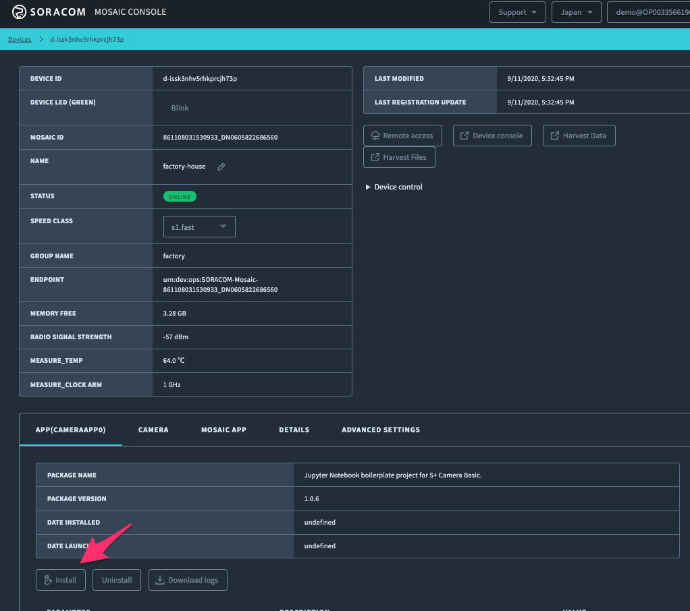
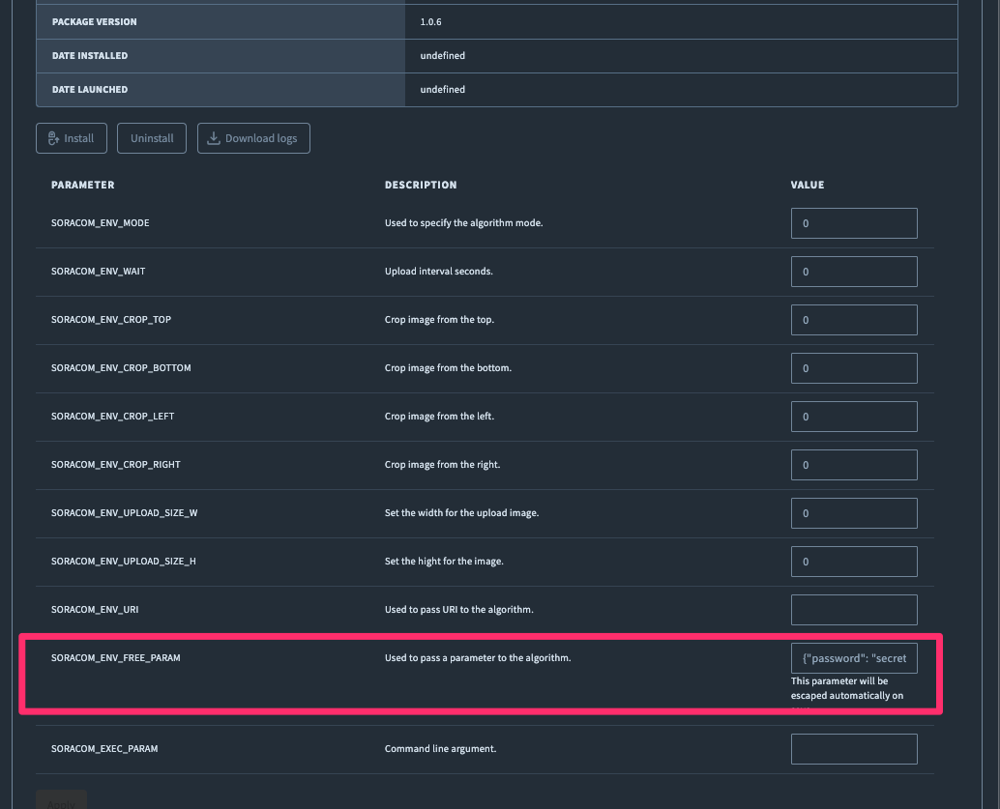
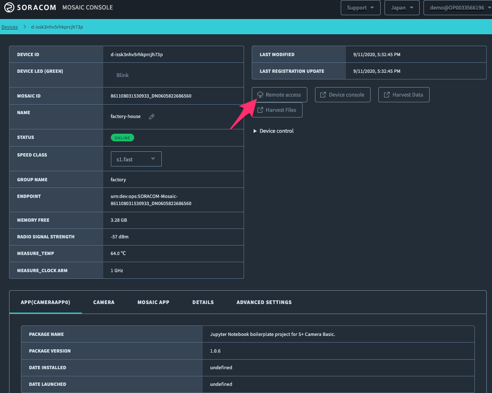
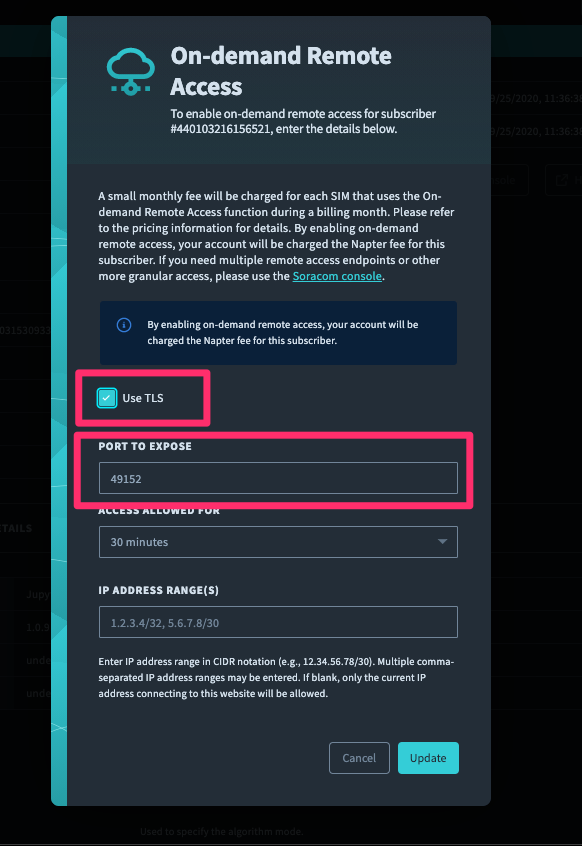
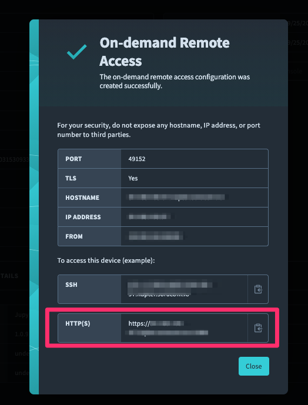

# Jupyter Notebook Boilerplate Project for S+ Camera Basic

This project enables to run Jupyer Notebook on S+ Camera Basic, which makes you interactive application development.

## Getting Started

Open your S+ Camera Basic device on SORACOM Mosaic console, then install by copy & paste [the latest built package URL](https://raw.githubusercontent.com/soracom-labs/splus-camera-jupyternotebook-boilerplate/master/build/CameraApp0.tgz). The modal will tell you how it goes step by step, like device is downloading the package, installing package, and when it's done, the modal will disappear. After installation procedure has been finished, you can find `PACKAGE_NAME` got updated as `Jupyter Notebook boilerplate project for S+ Camera Basic.` Now you can configure browser access to the notebook.

Then, configure your password to access the notebook. Put your password in form ot `{"password":"YOUR_PASSWORD"}` in `SORACOM_ENV_FREE_PARAM` text area and hit `apply`.

Next, you can configure browser access via `Remote Access`.

The Jupyter Notebook expose port 49152 for browsers. You can configure remote access like below.

Finally, you can access to Jupyter Notebook with the url shown on the modal!

It's all set, did Jupyter Notebook screen show up on your browser? Please login with your password above, then you can start your application development on your S+ Camera Basic now. You can use `camera_demo.ipynb` as your starter code.

*If Jupyter Notebook screen does not show up immediately, please wait a few minutes and try again, because after the installation modal disappear, still it will take few minutes to bootstrap Jupyter Notebook.(Internally, it does installing Jupyter and some modules via pip).*

